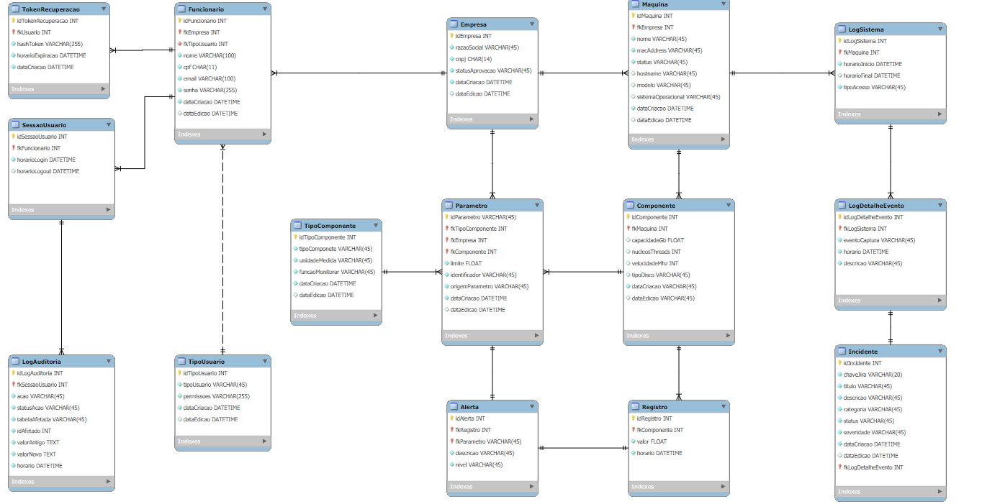

# 💾 BD OBERON - DOCUMENTAÇÃO COMPLETA DO BANCO DE DADOS

Este documento detalha o esquema final do banco de dados Oberon, focado em alta disponibilidade, rastreamento de ativos e auditoria completa de todas as ações administrativas.

---

## 1. Visão Geral e Arquitetura

### 1.1. Detalhes Técnicos

| Item | Valor |
| :--- | :--- |
| **SGBD** | MySQL (InnoDB) |
| **Nome do Esquema** | bdOberon |
| **Padrão de Nomenclatura Tabelas** | PascalCase Singular (Ex: Empresa, LogAuditoria) |
| **Padrão de Nomenclatura Campos** | camelCase (Ex: dataCriacao, fkCriadoPor) |
| **Objetivo** | Suportar a gestão de ativos, coleta de telemetria, regras de alerta (parâmetros) e trilha de auditoria completa. |
| **Diagrama (Fonte)** | [modelagem.mwdb] (Refletindo PKs Simples) |

#### 1.1.2 Diagrama

### 1.2. Domínios Principais

O esquema é organizado para separar o core do negócio (Monitoramento) da parte de gestão e segurança:

* **Core:** Tabelas base (`TipoComponente`, `TipoUsuario`, `Empresa`).
* **Auth & User:** `Funcionario`, `SessaoUsuario`, `TokenRecuperacao`.
* **Assets & Monitoring:** `Maquina`, `Componente`, `Parametro` (regras), `Registro` (telemetria).
* **Logs & Audit:** `LogAuditoria`, `Alerta`, `Incidente`.

---

## 2. Dicionário de Dados Detalhado (DD)

O Dicionário de Dados (DD) reflete a arquitetura final com chaves primárias simples (`AUTO_INCREMENT`).

### 2.1. Ativos e Monitoramento

| Tabela | Coluna | Tipo | PK/FK/AI/UQ | NOT NULL | Descrição |
| :--- | :--- | :--- | :--- | :--- | :--- |
| **`Maquina`** | **`idMaquina`** | INT | PK, AI | Sim | Identificador único da Máquina. |
| | `fkEmpresa` | INT | FK | Sim | Empresa proprietária da máquina. |
| | `macAddress` | VARCHAR(45) | - | Sim | MAC Address da máquina. |
| | `status` | ENUM | - | Sim | Status operacional: 'Online', 'Offline', 'Manutencao', etc. |
| **`Componente`** | **`idComponente`** | INT | PK, AI | Sim | Identificador único do Componente. |
| | `fkMaquina` | INT | FK | Sim | Máquina à qual este componente pertence. |
| | `capacidadeGb` | FLOAT | - | Não | Capacidade (RAM/Disco). |
| | `nucleosThreads` | INT | - | Não | Para CPU. |
| **`Parametro`** | **`idParametro`** | INT | PK, AI | Sim | Identificador da regra de limite. |
| | `fkTipoComponente` | INT | FK | Sim | Tipo de componente ao qual a regra se aplica. |
| | `limite` | FLOAT | - | Sim | Valor limite (threshold) para o alerta. |
| | `origemParametro` | VARCHAR(45) | - | Sim | 'OBERON', 'EMPRESA' ou 'ESPECIFICA'. |
| **`Registro`** | **`idRegistro`** | INT | PK, AI | Sim | PK da leitura de dados. |
| | `fkComponente` | INT | FK | Sim | Componente que gerou esta leitura. |
| | `valor` | FLOAT | - | Sim | Valor lido (ex: uso de CPU em %). |
| | `horario` | DATETIME | - | Sim | Timestamp exato da leitura. |
| **`Alerta`** | **`idAlerta`** | INT | PK, AI | Sim | PK da ocorrência do Alerta. |
| | `fkRegistro` | INT | FK | Sim | O Registro de dados que disparou o Alerta. |
| | `fkParametro` | INT | FK | Sim | O Parâmetro (regra) que disparou o Alerta. |
| | `nivel` | ENUM | - | Sim | Severidade do alerta. |

### 2.2. Usuários e Auditoria

| Tabela | Coluna | Tipo | PK/FK/AI/UQ | NOT NULL | Descrição |
| :--- | :--- | :--- | :--- | :--- | :--- |
| **`Funcionario`** | **`idFuncionario`** | INT | PK, AI | Sim | Identificador do Funcionário. |
| | `fkEmpresa` | INT | FK | Sim | Empresa do funcionário. |
| | `fkTipoUsuario` | INT | FK | Sim | Nível de acesso (Admin, Gerente, Colaborador). |
| | `cpf` | CHAR(11) | UQ | Sim | CPF do funcionário. |
| | `fkCriadoPor` | INT | FK | Sim | ID do funcionário que criou este registro. |
| **`SessaoUsuario`** | **`idSessaoUsuario`** | INT | PK, AI | Sim | ID da sessão de login ativa. |
| | `fkFuncionario` | INT | FK | Sim | Funcionário associado a esta sessão. |
| | `horarioLogin` | DATETIME | - | Sim | Momento do login. |
| **`LogAuditoria`** | **`idLogAuditoria`** | INT | PK, AI | Sim | PK do registro de auditoria. |
| | `fkSessaoUsuario` | INT | FK | Sim | Sessão que realizou a ação. |
| | `tabelaAfetada` | VARCHAR(45) | - | Sim | Tabela modificada pela ação. |
| | `valorAntigo` | TEXT | - | Não | Dados antes da alteração. |
| **`Incidente`** | **`idIncidente`** | INT | PK, AI | Sim | ID do ticket de problema. |
| | `chaveJira` | VARCHAR(20) | UQ | Sim | Chave externa (Jira) do incidente. |
| | `fkLogDetalheEvento` | INT | FK | Sim | Evento de log que originou o incidente. |
| | `status` | ENUM | - | Sim | Estado atual: 'Aberto', 'Resolvido', etc. |

---

## 3. Regras de Integridade e Triggers

### 3.1. Arquitetura de Chaves

Todas as tabelas foram padronizadas para usar Chaves Primárias Simples (PK), com o uso de `AUTO_INCREMENT` para facilitar a inserção de dados pela aplicação.

### 3.2. Trilha de Auditoria (Triggers)

A Auditoria é garantida por `Triggers` que preenchem automaticamente os campos de rastreamento de usuário e registram as ações na tabela `LogAuditoria`.

| Ação | Tabela(s) Afetada(s) | Lógica de Preenchimento Automático |
| :--- | :--- | :--- |
| `BEFORE INSERT` | `Funcionario`, `Maquina`, `Componente`, `Parametro`, `Incidente`, etc. | O trigger injeta o ID do usuário logado (`@audit_user_id`) na coluna `fkCriadoPor`. |
| `BEFORE UPDATE` | `Funcionario`, `Maquina`, `Componente`, `Parametro`, `Incidente` | O trigger atualiza a coluna `fkEditadoPor` com o ID do usuário logado. |
| `AFTER INSERT/UPDATE/DELETE` | Todas as tabelas principais | O trigger insere um registro detalhado na `LogAuditoria`, utilizando o `@audit_session_id` para rastrear a origem da ação. |

## 4. Como usar  
1. Clone este repositório  
2. Execute o script de configuração do usuário `\init.sh`

## 5 Documentação
Mais detalhes sobre os requisitos de banco de dados e integração estão descritos na [documentação principal]() disponivél nas pasta do one drive.

`Nota: Este repositório é privado e contém informações sensíveis de configuração de banco de dados.`