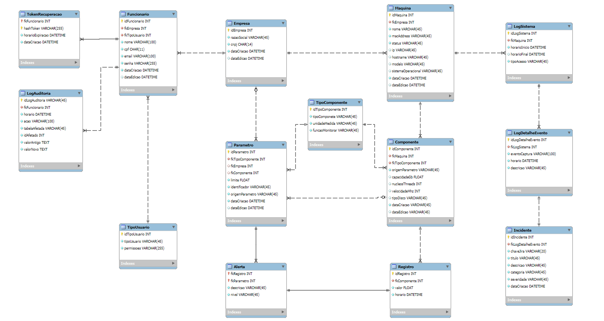
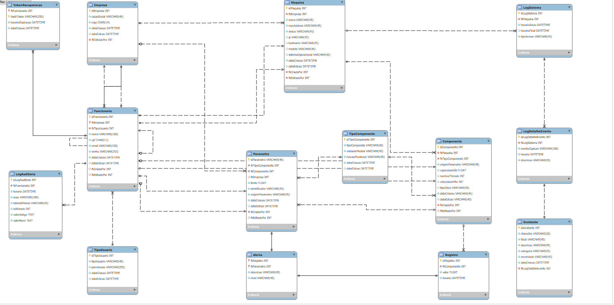

# 💾 BD OBERON - DOCUMENTAÇÃO COMPLETA DO BANCO DE DADOS

Este documento detalha o esquema final do banco de dados Oberon, focado em alta disponibilidade, rastreamento de ativos e auditoria completa de todas as ações administrativas, incluindo exclusões em cascata.

-----

## 1 Visão Geral e Arquitetura

### 1.1. Detalhes Técnicos

| Item | Valor |
| :--- | :--- |
| **SGBD** | MySQL (InnoDB) |
| **Nome do Esquema** | bdOberon |
| **Padrão de Nomenclatura Tabelas** | PascalCase Singular (Ex: Empresa, LogAuditoria) |
| **Padrão de Nomenclatura Campos** | camelCase (Ex: dataCriacao, fkCriadoPor) |
| **Objetivo** | Suportar a gestão de ativos, coleta de telemetria, regras de alerta (parâmetros) e trilha de auditoria completa, incluindo o rastreamento de exclusões em cascata. |
| **Diagrama (Fonte)** | [modelagem.mwdb] (Refletindo PKs Simples) |

#### 1.1.2 Diagrama
##### Diagrama Sem Campos de Referência

##### Diagrama Com Campos de Referência

### 1.2. Domínios Principais

O esquema é organizado para separar o core do negócio (Monitoramento) da parte de gestão e segurança:

  * **Core:** Tabelas base (`TipoComponente`, `TipoUsuario`, `Empresa`).
  * **Auth & User:** `Funcionario`, `TokenRecuperacao`. (A tabela `SessaoUsuario` foi removida/abstraída).
  * **Assets & Monitoring:** `Maquina`, `Componente`, `Parametro` (regras), `Registro` (telemetria).
  * **Logs & Audit:** `LogAuditoria`, `Alerta`, `Incidente`, `LogSistema`, `LogDetalheEvento`.

-----

## 2 Dicionário de Dados Detalhado (DD)

O Dicionário de Dados (DD) reflete a arquitetura final com chaves primárias simples (`AUTO_INCREMENT`).

### 2.1. Ativos e Monitoramento

| Tabela | Coluna | Tipo | PK/FK/AI/UQ | NOT NULL | Descrição |
| :--- | :--- | :--- | :--- | :--- | :--- |
| **`Maquina`** | **`idMaquina`** | INT | PK, AI | Sim | Identificador único da Máquina. |
| | `fkEmpresa` | INT | FK | Sim | Empresa proprietária da máquina. **ON DELETE CASCADE** |
| | `macAddress` | VARCHAR(45) | - | Sim | MAC Address da máquina. |
| | `status` | ENUM | - | Sim | Status operacional: 'Online', 'Offline', 'Manutencao', etc. |
| **`Componente`** | **`idComponente`** | INT | PK, AI | Sim | Identificador único do Componente. |
| | `fkMaquina` | INT | FK | Sim | Máquina à qual este componente pertence. **ON DELETE CASCADE** |
| | `capacidadeGb` | FLOAT | - | Não | Capacidade (RAM/Disco). |
| | `nucleosThreads` | INT | - | Não | Para CPU. |
| **`Parametro`** | **`idParametro`** | INT | PK, AI | Sim | Identificador da regra de limite. |
| | `fkTipoComponente` | INT | FK | Sim | Tipo de componente ao qual a regra se aplica. |
| | `fkComponente` | INT | FK | Não | Componente específico (para regras customizadas). **ON DELETE CASCADE** |
| | `fkEmpresa` | INT | FK | Não | Empresa (para regras globais da empresa). **ON DELETE CASCADE** |
| | `limite` | FLOAT | - | Sim | Valor limite (threshold) para o alerta. |
| | `origemParametro` | ENUM | - | Sim | 'OBERON', 'EMPRESA' ou 'ESPECIFICA'. |
| **`Registro`** | **`idRegistro`** | INT | PK, AI | Sim | PK da leitura de dados. |
| | `fkComponente` | INT | FK | Sim | Componente que gerou esta leitura. **ON DELETE CASCADE** |
| | `valor` | FLOAT | - | Sim | Valor lido (ex: uso de CPU em %). |
| | `horario` | DATETIME | - | Sim | Timestamp exato da leitura. |
| **`Alerta`** | **`idAlerta`** | INT | PK, AI | Sim | PK da ocorrência do Alerta. |
| | `fkRegistro` | INT | FK | Sim | O Registro de dados que disparou o Alerta. **ON DELETE CASCADE** |
| | `fkParametro` | INT | FK | Sim | O Parâmetro (regra) que disparou o Alerta. **ON DELETE CASCADE** |
| | `nivel` | ENUM | - | Sim | Severidade do alerta. |

### 2.2. Usuários e Auditoria

| Tabela | Coluna | Tipo | PK/FK/AI/UQ | NOT NULL | Descrição |
| :--- | :--- | :--- | :--- | :--- | :--- |
| **`Funcionario`** | **`idFuncionario`** | INT | PK, AI | Sim | Identificador do Funcionário. |
| | `fkEmpresa` | INT | FK | Sim | Empresa do funcionário. **ON DELETE CASCADE** |
| | `fkTipoUsuario` | INT | FK | Sim | Nível de acesso (Admin, Gerente, Colaborador). |
| | `cpf` | CHAR(11) | UQ | Sim | CPF do funcionário. |
| | `fkCriadoPor` | INT | FK | Não | ID do funcionário que criou este registro. **ON DELETE SET NULL** |
| **`LogAuditoria`** | **`idLogAuditoria`** | INT | PK, AI | Sim | PK do registro de auditoria. |
| | `fkFuncionario` | INT | FK | Sim | Funcionário que realizou a ação. |
| | `tabelaAfetada` | VARCHAR(45) | - | Sim | Tabela modificada pela ação. |
| | `acao` | VARCHAR(20) | - | Sim | Tipo de ação ('INSERT', 'UPDATE', 'DELETE CASCADE'). |
| | `valorAntigo` | JSON | - | Não | Dados antes da alteração (apenas em UPDATE/DELETE). |
| **`Incidente`** | **`idIncidente`** | INT | PK, AI | Sim | ID do ticket de problema. |
| | `chaveJira` | VARCHAR(20) | UQ | Sim | Chave externa (Jira) do incidente. |
| | `fkLogDetalheEvento` | INT | FK | Sim | Evento de log que originou o incidente. **ON DELETE CASCADE** |
| | `status` | ENUM | - | Sim | Estado atual: 'Aberto', 'Resolvido', etc. |

-----

## 3 Regras de Integridade e Triggers

### 3.1. Chaves Estrangeiras (`ON DELETE`)

A integridade do sistema foi reforçada para garantir a limpeza automática e evitar o erro `1442` em deleções hierárquicas:

  * **`ON DELETE CASCADE`:** Usado em todas as relações de dependência estrita (e.g., deletar `Maquina` deleta todos os `Componente`s, `Registro`s e `Alerta`s relacionados).
  * **`ON DELETE SET NULL`:** Usado exclusivamente nos campos de auditoria (`fkCriadoPor`, `fkEditadoPor`) para que a exclusão de um funcionário não apague o registro que ele criou, apenas remove a autoria.

### 3.2. Trilha de Auditoria (Triggers)

A auditoria rastreia as ações com base na **variável de sessão `@USUARIO_LOGADO`**, que deve ser definida pela aplicação antes de cada ação administrativa.

| Ação | Tabela(s) Afetada(s) | Lógica de Auditoria |
| :--- | :--- | :--- |
| `BEFORE INSERT/UPDATE` | `Funcionario`, `Maquina`, `Componente`, etc. | O trigger injeta/atualiza o `fkCriadoPor` / `fkEditadoPor` com o valor de `@USUARIO_LOGADO` e o `dataCriacao` / `dataEdicao` com `CURRENT_TIMESTAMP`. |
| `AFTER INSERT/UPDATE` | Todas as tabelas principais | O trigger insere um registro detalhado na `LogAuditoria` (com `valorAntigo`/`valorNovo`), rastreando a ação via `@USUARIO_LOGADO`. |
| **`BEFORE DELETE` (Auditoria Cascata)** | `Empresa`, `Maquina`, `Componente` | O trigger **conta os registros filhos** que serão excluídos pelo `CASCADE` e insere um registro único na `LogAuditoria` com a ação `DELETE CASCADE` e o impacto total (e.g., "Deletou 5 Máquinas, 20 Componentes..."). |

## 4 Como usar

1.  Clone este repositório.
2.  Execute o script de configuração do usuário `\init.sh`.
3.  Para testar a auditoria, defina a sessão antes de qualquer DELETE: `SET @USUARIO_LOGADO = [ID_DO_FUNCIONARIO];`

## 5 Documentação

Mais detalhes sobre os requisitos de banco de dados e integração estão descritos na [documentação principal]() disponivél nas pasta do one drive.

`Nota: Este repositório é privado e contém informações sensíveis de configuração de banco de dados.`